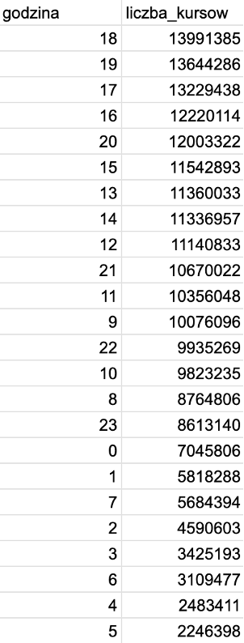
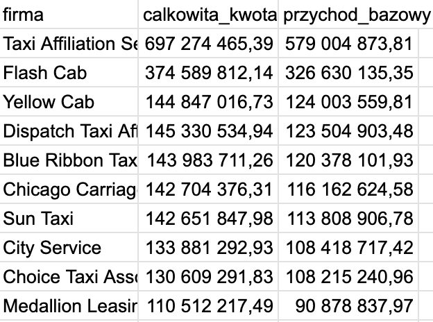
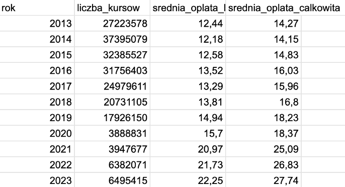
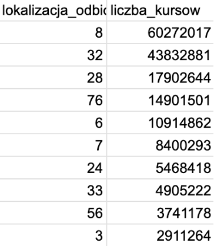

# 🚖 Analiza danych: Chicago Taxi Trips

**Technologie:** SQL, Google BigQuery
**Zbiór danych:** `bigquery-public-data.chicago_taxi_trips.taxi_trips`

> 📄 **Pełny raport z analizy (wszystkie 12 zapytań wraz ze szczegółowym omówieniem krok po kroku oraz sprawdzeniem jakości danych) znajduje się w pliku [raport_chicago_taxi.pdf](raport_chicago_taxi.pdf) załączonym do tego repozytorium.**
> Pełny kod SQL dostępny jest w pliku [chicago_taxi_queries.sql](chicago_taxi_queries.sql).

Poniżej znajduje się podsumowanie (*Executive Summary*) prezentujące najciekawsze wnioski biznesowe płynące z danych.

---

## 📌 Najciekawsze wnioski z analizy

### 1. Nocne życie Chicago napędza rynek (Godziny szczytu)
Co ciekawe, z danych wyłania się obraz Chicago jako miasta o bardzo aktywnym życiu nocnym. Liczba kursów o północy jest zauważalnie wyższa niż w trakcie porannych dojazdów (godzina 7:00). Wynika to prawdopodobnie z faktu, że rano mieszkańcy chętniej wybierają komunikację miejską, aby uniknąć korków, natomiast w nocy taksówki stają się najbezpieczniejszym sposobem powrotu do domu. Największy szczyt przypada na godziny 16:00–19:00, a o 18:00 zapotrzebowanie na taksówki jest ponad 6-krotnie większe niż nad ranem o 5:00.

```sql
SELECT
  EXTRACT(HOUR FROM trip_start_timestamp) AS godzina,
  COUNT(*) AS liczba_kursow
FROM `bigquery-public-data.chicago_taxi_trips.taxi_trips`
GROUP BY godzina
ORDER BY liczba_kursow DESC;
```


### 2. Dominacja giganta na rynku (Analiza przychodów TOP 10)
Analiza dziesięciu największych firm pokazuje wyraźną dominację Taxi Affiliation Services, której przychód bazowy wyniósł około 579 mln USD, czyli niemal dwukrotnie więcej niż drugiego w zestawieniu Flash Cab (ok. 327 mln USD). Oznacza to, że lider rynku wyraźnie przewyższa pozostałych przewoźników pod względem skali działalności, natomiast między firmami z miejsc 3–10 różnice są stosunkowo niewielkie.

```sql
SELECT
  COMPANY AS firma,
  ROUND(SUM(trip_total), 2) AS calkowita_kwota,
  ROUND(SUM(fare), 2) AS przychod_bazowy
FROM `bigquery-public-data.chicago_taxi_trips.taxi_trips`
WHERE company IS NOT NULL
GROUP BY firma
ORDER BY przychod_bazowy DESC;
```


### 3. Drastyczny wpływ pandemii COVID-19 (Trendy wieloletnie)
Liczba realizowanych kursów wykazuje trend spadkowy od 2015 roku, jednak największe, wręcz drastyczne załamanie rynku widać między rokiem 2019 a 2020, co wynikało z wybuchu pandemii COVID-19 (obostrzenia, załamanie turystyki, praca zdalna). Dopiero od 2021 roku widać pierwsze sygnały odbicia branży. Co ciekawe, średnia opłata za przejazd z roku na rok sukcesywnie rośnie.

```sql
SELECT
  EXTRACT(YEAR FROM trip_start_timestamp) AS rok,
  COUNT(*) AS liczba_kursow,
  ROUND(AVG(fare), 2) AS srednia_oplata_bazowa,
  ROUND(AVG(trip_total), 2) AS srednia_oplata_calkowita
FROM `bigquery-public-data.chicago_taxi_trips.taxi_trips`
GROUP BY rok
ORDER BY rok ASC;
```


### 4. Turystyka, biznes i lotniska generują ruch (Najlepsze lokalizacje)
Z gigantyczną przewagą króluje strefa numer 8 (Near North Side), czyli typowe miejsce turystyczne i rozrywkowe miasta. Zaraz za nim znajduje się ścisłe biznesowe centrum (Loop), a na czwartym miejscu strefa 76, która odpowiada za międzynarodowe lotnisko O'Hare. Wynika z tego jasno, że ruch taksówkarski napędza głównie rozrywka, turystyka, biznes i transfery lotniskowe.

```sql
SELECT pickup_community_area AS lokalizacja_odbioru,
  COUNT(*) AS liczba_kursow
FROM `bigquery-public-data.chicago_taxi_trips.taxi_trips`
WHERE pickup_community_area IS NOT NULL
GROUP BY lokalizacja_odbioru
ORDER BY liczba_kursow DESC;
```


---

## 🔍 Pełny zakres analizy

Kompletność i jakość danych • duplikaty • godziny szczytu • ranking firm wg przychodów • średnie parametry przejazdu • segmentacja kursów wg dystansu • metody płatności i napiwki • koszt za milę wg firmy • trendy roczne 2015–2023 • lokalizacje odbioru (Community Areas) • wpływ pory dnia na czas przejazdu.

## 🗂 Struktura repozytorium

```
├── README.md
├── raport_chicago_taxi.pdf
├── chicago_taxi_queries.sql
└── images/
    ├── 04_godziny_szczytu.png
    ├── 05_najwieksze_firmy.png
    ├── 10_trendy_w_latach.png
    └── 11_najlepsze_lokalizacje.png
```
